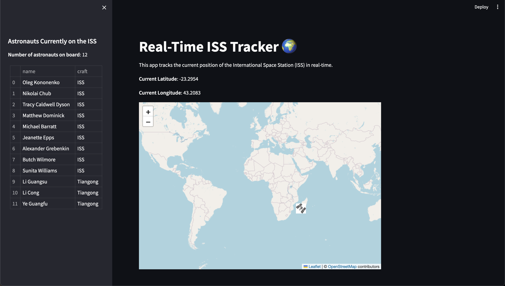

# ISS Tracker 🌍🚀

This project is a real-time ISS (International Space Station) tracking application built using Streamlit and Folium. It displays the live position of the ISS on an interactive map with a custom marker and provides information on the current astronauts aboard.

## Table of Contents
- [Project Overview](#project-overview)
- [Features](#features)
- [Installation](#installation)
- [Usage](#usage)
- [Dependencies](#dependencies)
- [Screenshots](#screenshots)
- [Future Enhancements](#future-enhancements)
- [Contributing](#contributing)
- [License](#license)

## Project Overview
The **ISS Tracker** provides an easy way to visualize the real-time position of the International Space Station. By leveraging the `Open Notify` API, it fetches live ISS position data and updates its location on a world map. The app also displays the names of astronauts currently aboard the ISS and your current location for reference.

## Features
- 📍 **Real-time ISS Position Tracking**: Visualize the current location of the ISS on an interactive map.
- 👩‍🚀 **Astronaut Information**: Displays the number and names of astronauts currently on the ISS.
- 🗺️ **Custom Map Marker**: Uses a custom ISS marker for better visualization.
- 🏠 **Your Location**: Shows your current geographic position for reference.
- 🔄 **Auto Refresh**: The app auto-refreshes to show the updated position of the ISS.

## Installation

1. Clone the repository:

   ```bash
   git clone https://github.com/AbdullahMSaid/ISS_Tracker.git

2. Install the required dependencies:
   ```bash
   pip install -r requirements.txt
   ```

## Features
- Live map displaying the current position of the ISS.
- Marker indicating the location of the ISS using a custom image.
- Displays your current geographical location.

## Usage
To run on streamlit, use the following command:

```bash
streamlit run iss_tracker.py
```

To run on locally using Pygame, use the following command:

```bash
streamlit run main.py
```

Once the server is up, it will open a new tab in your web browser displaying the live map.

## Dependencies
- **Streamlit**: For building the interactive web app.
- **Folium**: For creating interactive maps.
- **streamlit_folium**: Integration of Folium maps within Streamlit.
- **geocoder**: For getting your current location.
- **requests**: To make API requests to get ISS data.

## Screenshots

#### WebApp Version (Streamit)


#### App Version (Streamit)


## Future Enhancements 

* 🌐 **Add More Map Styles**: Include dark mode or satellite imagery. 
* 🔧 **Additional Filters**: Show different orbits of satellites and add more controls. 
* 📊 **Data Analysis**: Track the ISS's historical path and display patterns. 
* 📈 **Performance Optimization**: Improve real-time tracking performance. 
* 💬 **Astronaut Information**: Fetch and display more details about each astronaut aboard.”

## Contributing  
Feel free to submit issues and pull requests!

## License  
OPENSOURCE FREE USE. But also make sure to follow the rules of the API

## Contact
* **GitHub**: [AbdullahMSaid](https://github.com/AbdullahMSaid)

 * **Email**: AbdullahiMSaid@live.com